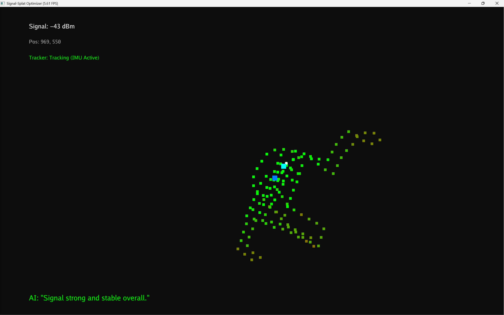

# 📡 NETSPLAT: Edge AI Network Diagnostics & Spatial Mapping

**NETSPLAT** is an autonomous, Edge-AI-driven RF diagnostic system. It leverages smartphone IMU sensor fusion (Pedestrian Dead Reckoning) to physically map indoor environments, captures raw 802.11 Wi-Fi telemetry, and renders 60FPS high-fidelity heatmaps via GPU parallelization. 

A localized instance of **Llama 3** acts as an embedded autonomous agent, calculating dead-zone clusters and outputting enterprise-grade hardware relocation strategies in real time.




## System Architecture

This project is built on a modular, multi-threaded engine architecture to ensure zero latency between physical movement, hardware polling, and GPU rendering.

* **`location_tracker.py` (Sensor Fusion Engine):** Runs a lightweight Flask server to catch raw IMU payloads (Linear Acceleration & Orientation) streamed from a mobile device. Implements a custom mathematical filter to cancel out gravity constraints and calculate physical strides via Pedestrian Dead Reckoning (PDR).
* **`wifi_sensor.py` (Telemetry Engine):** Directly interfaces with the physical Network Interface Card (NIC) via `pywifi` to extract hardware-level RSSI metrics, locking onto specific MAC/SSIDs to prevent ghost-tracking.
* **`renderer.py` (GPU Compute Engine):** Utilizes `taichi` to compile Python into CUDA shaders. Performs real-time Inverse Distance Weighting (IDW) optimization across a 1920x1080 canvas, blending sparse telemetry points into a continuous fluid heatmap.
* **`agent_brain.py` (AI Diagnostic Engine):** Integrates with `ollama` to run Llama 3 entirely on the edge. It isolates low-signal clusters (< -75dBm), calculates their geographic center of mass, and generates highly technical routing/hardware recommendations.

## Key Features
* **Zero-Infrastructure SLAM:** Maps physical space using only human movement and IMU physics—no LIDAR or pre-mapped floor plans required.
* **Generative Spatial Optimization:** Drop digital markers for current router locations and let the embedded LLM calculate the mathematically optimal placement to bridge detected dead zones.
* **100% Local Processing:** From the Wi-Fi hardware polling to the Llama 3 inference, the entire pipeline executes on local edge compute without requiring cloud APIs or internet access.

## Installation & Usage

**Prerequisites:** Python 3.10+, an active Ollama installation (running `llama3`), and a smartphone with the *Sensor Logger* app.

1. **Clone & Install:**
   ```bash
   git clone [https://github.com/YourUsername/Signal-Splat.git](https://github.com/YourUsername/Signal-Splat.git)
   cd Signal-Splat
   pip install -r requirements.txt
   python main.py
2. **Install "Sensor Logger" by Kevin from Google Play/App Store:**
   Enable Linear Acceleration and Orientation.
   Go to settings and set the (Push through HTTP) Push URL to your local machine's IP (e.g., http://<Your IPV4 address>:5000/data).
   Hit "Start Recording" and walk the perimeter of the target environment.

## Keyboard Controls

The Taichi GPU window must be actively selected/focused to register these keystrokes:

* **`1`** : Drops a Cyan marker at your current physical location to register **Router 1**.
* **`2`** : Drops a Blue marker at your current physical location to register **Router 2** (for those with more than one router on the same floor and must be same LAN).
* **`O`** : Toggles the GPU spatial optimization. Switches between the raw IMU scatter plot and the mathematically blended IDW (Inverse Distance Weighting) heatmap surface.
* **`Enter` / `Return`** : Triggers the Llama 3 Autonomous Agent. The system will freeze briefly while it calculates dead-zone clusters and queries the LLM. It then drops a **Purple Star** at the optimal hardware relocation coordinates.

---

## How to Operate (Step-by-Step)

To run a successful RF diagnostic mapping session, follow these steps exactly:

### Phase 1: The Network Lock
1. Stand physically close to your target Wi-Fi router.
2. Run the orchestrator script on your laptop: `python main.py`.
3. Wait a few seconds for the terminal to output: `📡 Locked onto Target Network: '<Your_SSID>'`. This ensures the system tracks your specific network and ignores neighboring routers.

### Phase 2: Sensor Calibration
1. Open the **Sensor Logger** app on your smartphone.
2. Ensure **Linear Acceleration** and **Orientation** are toggled ON. 
3. Verify the "Push to Server" URL is pointing to your laptop's IP address (e.g., `http://192.168.1.X:5000/data`).
4. Hold your phone completely flat in front of you (like holding a tray).

### Phase 3: Physical Mapping
1. Tap **Start Recording** in the app.
2. Walk at a normal, steady pace around your house. The Taichi window will draw a breadcrumb trail tracking your exact path.
3. *Crucial:* Make sure to walk into known "Dead Zones" (behind thick walls or far from the router) so the system logs the low-signal red data points.
4. When you physically stand next to your first router, press **`1`**. If you have a second router/mesh node, walk to it and press **`2`**.

### Phase 4: AI Analysis
1. Stop walking.
2. Press **`O`** to view the interpolated heatmap splat of your entire floor plan.
3. Press **`Enter`** to query Llama 3. Read the terminal for the highly technical RF recommendation, and look for the **Purple Star** on your map showing exactly where to move your hardware.
